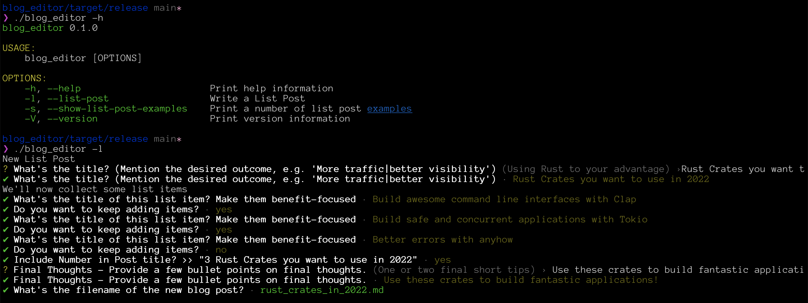

# blog_editor

**Blog Editor is a small Rust CLI that supports you with your daily blogging tasks, such as generating templates for a new post.**

## About

Writing blog posts is fun and allows you to share your unique ideas with the community. While we often focus most on coming up with content, we neglect finding the right form.

This tool supports you with the task of structuring your blog posts so that they're appealing to your readers and search engines.

## Usage

1. Clone this repository: `git clone https://github.com/schultyy/blog_editor.git`
2. `cd blog_editor`
3. `cargo build --release`
4. Copy the binary into your path
5. Run it

### How it looks like

### Supported Blog Post Types

- List Posts

Based on https://ahrefs.com/blog/blog-post-templates/

### Misc

`blog_editor` allows you to add notes for sub headlines. For that, it opens the default editor. You can override it by setting the `EDITOR` environment variable.

**VSCode:** `EDITOR="vscode -w"`
**Vim**: `EDITOR=vim`
**Nano**: `EDITOR=nano`

## License

MIT